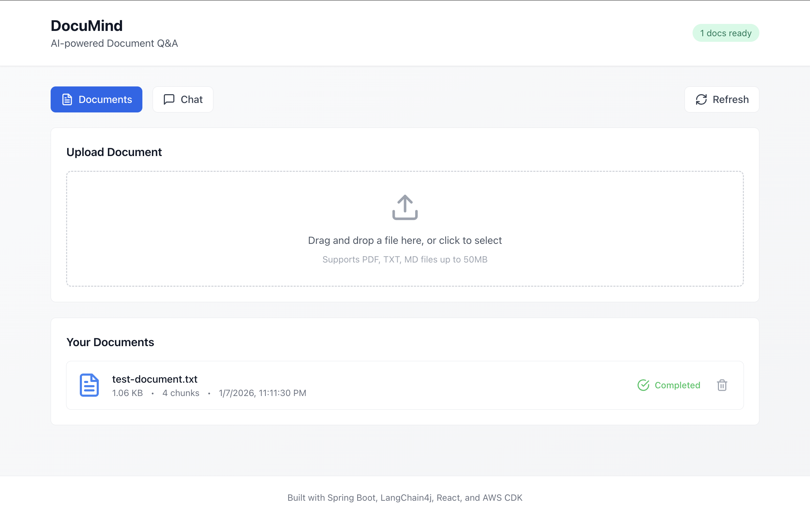
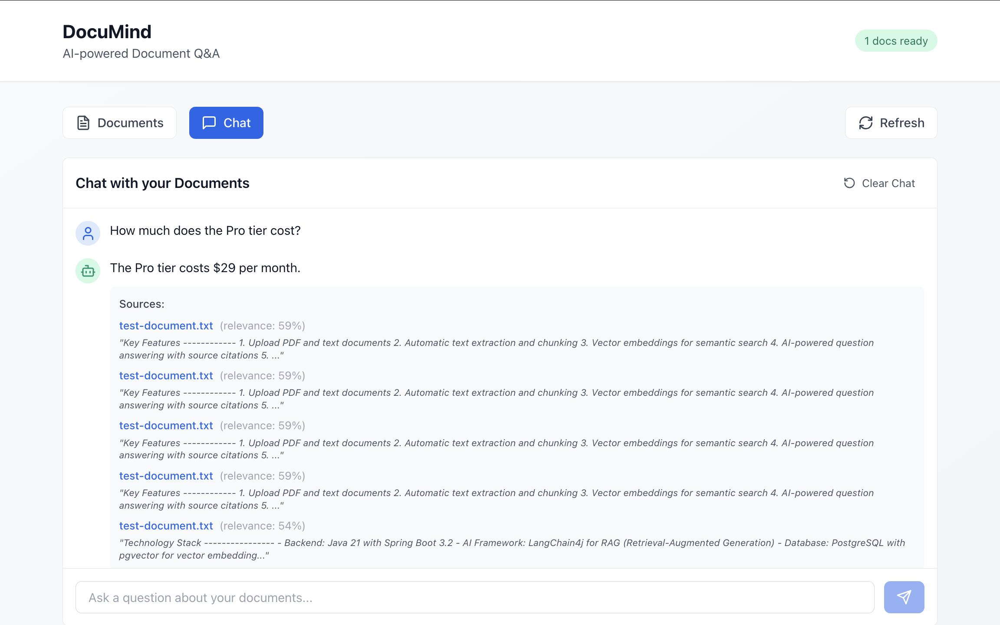

<h1 align="center">DocuMind - AI Document Q&A Service</h1>

<p align="center">
  <a href="https://openjdk.org/"></a>
  <a href="https://spring.io/projects/spring-boot"></a>
  <a href="https://reactjs.org/"></a>
  <a href="https://www.typescriptlang.org/"></a>
  <a href="https://aws.amazon.com/cdk/"></a>
  <a href="https://docs.langchain4j.dev/"></a>
  <a href="https://www.postgresql.org/"></a>
  <a href="https://www.docker.com/"></a>
</p>

## 🌱 Overview

Upload documents and ask questions — DocuMind uses RAG (Retrieval-Augmented Generation) to provide accurate, context-aware answers from your files.

A demo MVP showcasing Java, TypeScript, AWS CDK, LangChain4j, Spring Boot, and React.

**Why?** To demonstrate a production-ready AI application with modern infrastructure. Useful for teams needing quick answers from documentation, research papers, or internal knowledge bases.

*Built in Boston, USA — January 2026*

## Table of Contents

- [Live Demo](#-live-demo)
- [Screenshot](#screenshot)
- [Features](#features)
- [Architecture](#architecture)
- [Project Structure](#project-structure)
- [Local Development](#local-development)
- [Environment Variables](#environment-variables)
- [AWS Deployment](#aws-deployment)
- [Author](#author)
- [License](#license)
- [Full Documentation](docs/ARCHITECTURE.md)

## 🚀 Live Demo

| Resource | URL |
|----------|-----|
| **Frontend** | [https://d3py6xai9gspab.cloudfront.net](https://d3py6xai9gspab.cloudfront.net) |
| **API** | [http://DocuMi-Backe-Mnku72pk6qQ2-534965933.us-east-1.elb.amazonaws.com](http://DocuMi-Backe-Mnku72pk6qQ2-534965933.us-east-1.elb.amazonaws.com) |

## Screenshot




*Upload a document, ask questions, and get AI-powered answers with source citations.*

## Features

- PDF/Text document upload
- Automatic text extraction and chunking
- Vector embeddings with pgvector
- RAG-based Q&A with LangChain4j
- Conversation history
- Modern React UI

## Architecture

```
┌─────────────────┐     ┌──────────────────┐     ┌─────────────────┐
│  React Frontend │────▶│  Spring Boot API │────▶│  LangChain4j    │
│  (TypeScript)   │     │  (Java 21)       │     │  + OpenAI/Local │
└─────────────────┘     └──────────────────┘     └─────────────────┘
                               │
                    ┌──────────┴──────────┐
                    ▼                     ▼
              ┌──────────┐         ┌──────────────┐
              │    S3    │         │  PostgreSQL  │
              │  (Docs)  │         │  (pgvector)  │
              └──────────┘         └──────────────┘
```

### AI Architecture (RAG Pipeline)

```
┌─────────────────────────────────────────────────────────────────────────────────────┐
│                              DOCUMENT INGESTION                                     │
│                                                                                     │
│  ┌──────────┐    ┌──────────────┐    ┌──────────────┐    ┌───────────────────────┐  │
│  │  Upload  │───▶│  Parse PDF/  │───▶│   Chunk      │───▶│  Generate Embeddings  │  │
│  │  Document│    │  Text Files  │    │   (1500 char)│    │  (AllMiniLmL6V2)      │  │
│  └──────────┘    └──────────────┘    └──────────────┘    └───────────┬───────────┘  │
│                                                                      │              │
│                                                                      ▼              │
│                                                          ┌───────────────────────┐  │
│                                                          │  Store in pgvector    │  │
│                                                          │  (PostgreSQL)         │  │
│                                                          └───────────────────────┘  │
└─────────────────────────────────────────────────────────────────────────────────────┘

┌─────────────────────────────────────────────────────────────────────────────────────┐
│                              QUESTION ANSWERING                                     │
│                                                                                     │
│  ┌──────────┐    ┌──────────────┐    ┌──────────────┐    ┌───────────────────────┐  │
│  │  User    │───▶│  Embed       │───▶│  Vector      │───▶│  Retrieve Top 5       │  │
│  │  Question│    │  Question    │    │  Similarity  │    │  Relevant Chunks      │  │
│  └──────────┘    └──────────────┘    └──────────────┘    └───────────┬───────────┘  │
│                                                                      │              │
│                                                                      ▼              │
│  ┌──────────┐    ┌──────────────────────────────────────────────────────────────┐   │
│  │  Answer  │◀───│  OpenAI GPT-4o-mini generates answer with context + sources  │   │
│  └──────────┘    └──────────────────────────────────────────────────────────────┘   │
└─────────────────────────────────────────────────────────────────────────────────────┘
```

### AWS Infrastructure

```
┌─────────────────────────────────────────────────────────────────────────────────────┐
│                                    USERS                                            │
└─────────────────────────────────────┬───────────────────────────────────────────────┘
                                      │ HTTPS
                                      ▼
┌─────────────────────────────────────────────────────────────────────────────────────┐
│                              CLOUDFRONT CDN                                         │
│                    https://d3py6xai9gspab.cloudfront.net                            │
│                                                                                     │
│  ┌─────────────────┐                              ┌─────────────────┐               │
│  │   Static Assets │◄─────────────────────────────┤   API Routes    │               │
│  │   (/, /*, etc.) │                              │   (/api/*)      │               │
│  └─────────────────┘                              └─────────────────┘               │
└─────────────┬───────────────────────────────────────────────┬───────────────────────┘
              │                                               │
              ▼                                               ▼
┌─────────────────────────────────────┐    ┌─────────────────────────────────────────┐
│            S3 BUCKET                │    │        APPLICATION LOAD BALANCER        │
│   documind-frontend-884710187119    │    │              (Port 80)                  │
│         (Frontend Assets)           │    └─────────────┬───────────────────────────┘
└─────────────────────────────────────┘                  │ HTTP
                                                         ▼
┌─────────────────────────────────────────────────────────────────────────────────────┐
│                                    VPC                                              │
│                          (us-east-1a & us-east-1b)                                  │
│                                                                                     │
│  ┌─────────────────────────────────────────────────────────────────────────────┐    │
│  │                           PUBLIC SUBNETS                                    │    │
│  │  ┌─────────────────┐                    ┌─────────────────┐                 │    │
│  │  │ Internet Gateway│                    │   NAT Gateway   │                 │    │
│  │  └─────────────────┘                    └─────────────────┘                 │    │
│  └─────────────────────────────────────────────────────────────────────────────┘    │
│                                           │ Outbound Internet                       │
│                                           ▼                                         │
│  ┌─────────────────────────────────────────────────────────────────────────────┐    │
│  │                          PRIVATE SUBNETS                                    │    │
│  │                                                                             │    │
│  │  ┌─────────────────────────────────────────────────────────────────────┐    │    │
│  │  │                    ECS FARGATE CLUSTER                              │    │    │
│  │  │                                                                     │    │    │
│  │  │  ┌─────────────┐  ┌─────────────┐  ┌─────────────┐                  │    │    │
│  │  │  │ ECS Task    │  │ ECS Task    │  │ ECS Task    │                  │    │    │
│  │  │  │documind-api │  │documind-api │  │documind-api │                  │    │    │
│  │  │  └─────────────┘  └─────────────┘  └─────────────┘                  │    │    │
│  │  │              Auto Scaling: 50% - 200% capacity                      │    │    │
│  │  └─────────────────────────────────────────────────────────────────────┘    │    │
│  │                                           │ Database Connection             │    │
│  │                                           ▼                                 │    │
│  │  ┌─────────────────────────────────────────────────────────────────────┐    │    │
│  │  │                    RDS POSTGRESQL                                   │    │    │
│  │  │  Instance: db.t3.micro | Storage: 20GB (auto-scale to 100GB)        │    │    │
│  │  └─────────────────────────────────────────────────────────────────────┘    │    │
│  └─────────────────────────────────────────────────────────────────────────────┘    │
└─────────────────────────────────────────────────────────────────────────────────────┘
                                           │ Document Storage
                                           ▼
┌─────────────────────────────────────────────────────────────────────────────────────┐
│  S3 DOCUMENTS BUCKET: documind-documents-884710187119 (Encrypted, CORS enabled)     │
└─────────────────────────────────────────────────────────────────────────────────────┘

┌─────────────────────────────────────────────────────────────────────────────────────┐
│  SECURITY: Security Groups │ IAM Roles │ Secrets Manager (DB creds, OpenAI key)     │
└─────────────────────────────────────────────────────────────────────────────────────┘
```

**Key Features:**
- **High Availability**: Multi-AZ deployment across two availability zones
- **Scalability**: Auto-scaling ECS service and RDS storage
- **Security**: Private subnets for application and database tiers
- **Performance**: CloudFront CDN for global content delivery
- **AI Integration**: OpenAI API for intelligent document processing

## Project Structure

```
├── backend/          # Spring Boot + LangChain4j API
├── frontend/         # React + TypeScript UI
└── infra/            # AWS CDK Infrastructure
```

## Local Development

Run everything locally using Docker for PostgreSQL.

### Prerequisites
- Java 21+
- Node.js 20+
- Docker

### 1. Start PostgreSQL (with pgvector)
```bash
cd backend
docker compose up -d
```

### 2. Configure Environment
Create `backend/.env` with your OpenAI API key (see [Environment Variables](#environment-variables)).

### 3. Start Backend
```bash
cd backend
mvn spring-boot:run
```

### 4. Start Frontend
```bash
cd frontend
npm install
npm run dev
```

Access the app at **http://localhost:5173**

## Environment Variables

| Variable | Description | Required | Default |
|----------|-------------|----------|--------|
| `OPENAI_API_KEY` | OpenAI API key for GPT-4o-mini | Yes | - |
| `SPRING_DATASOURCE_URL` | PostgreSQL connection URL | No | `jdbc:postgresql://localhost:5432/documind` |
| `SPRING_DATASOURCE_USERNAME` | Database username | No | `documind` |
| `SPRING_DATASOURCE_PASSWORD` | Database password | No | `documind` |

**Local Development:** Create `backend/.env`:
```
OPENAI_API_KEY=sk-your-key-here
```

**AWS Deployment:** Store in Secrets Manager (see [Post-Deploy](#post-deploy-configure-openai-key)).

---

## AWS Deployment

The app is currently deployed on AWS. To deploy your own instance:

### Prerequisites
- AWS CLI configured (`aws configure`)
- AWS CDK installed (`npm install -g aws-cdk`)

### Deploy
```bash
cd infra
npm install
npx cdk bootstrap   # First time only
npx cdk deploy
```

### Post-Deploy: Configure OpenAI Key
```bash
aws secretsmanager put-secret-value \
  --secret-id documind/openai-api-key \
  --secret-string '{"apiKey":"sk-your-actual-key"}'
```

### Deploy Frontend Updates
```bash
cd frontend
npm run build
aws s3 sync dist/ s3://documind-frontend-<ACCOUNT_ID>-<REGION>/ --delete
aws cloudfront create-invalidation --distribution-id <DIST_ID> --paths "/*"
```

## Author

**Amir Olyaei**

- [DevArts](https://notion.so/61c6b79808ce476290c753165851b070)
- [LinkedIn](https://www.linkedin.com/in/amirolyaei/)

## License

MIT License - see [LICENSE](LICENSE) for details.
